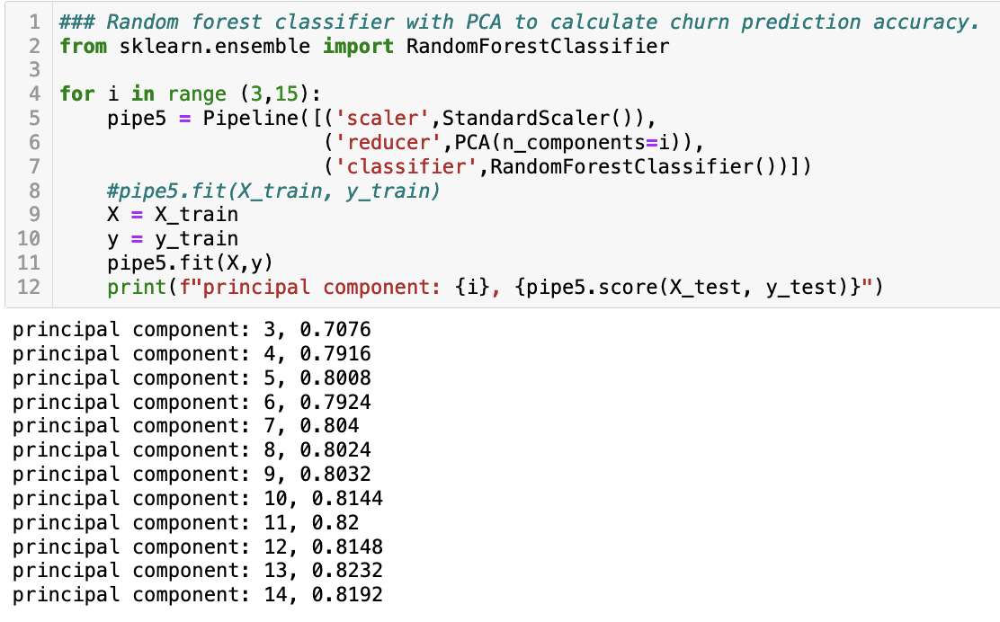

# Data-Cleaning-&-Principal-Component-Analysis

Data cleaning, also known as data cleansing or data scrubbing, is a critical process in data analysis that involves identifying and correcting errors, inconsistencies, and inaccuracies in a dataset. It is an essential step before performing any meaningful analysis because the quality of the analysis and the insights derived from the data heavily depend on the cleanliness of the data.

The process of data cleaning can be broken down into several key steps:
* Identifying Data Issues: The first step is to examine the dataset and identify potential issues. These issues can include missing values, duplicate records, incorrect data types, outliers, and formatting errors.
* Handling Missing Data: Missing data can be problematic as it can lead to biased or inaccurate results. There are various ways to handle missing data, such as removing rows or columns with missing values, imputing missing values based on statistical measures like mean, median, or mode, or using more advanced techniques like interpolation or machine learning algorithms for imputation.
* Removing Duplicates: Duplicates in the dataset can skew the analysis by giving undue weight to certain records. Identifying and removing or consolidating duplicate records is necessary to maintain data integrity.
* Correcting Inaccurate Values: Sometimes, data may contain inaccuracies or errors due to manual entry or other reasons. These errors need to be corrected to ensure the data reflects accurate information.
* Dealing with Outliers: Outliers are data points that deviate significantly from the rest of the data. They can impact statistical analyses and lead to incorrect conclusions. Depending on the nature of the analysis, outliers may be removed, transformed, or handled using more sophisticated techniques.
* Standardizing Formats: Data collected from different sources or systems might have inconsistent formats. Standardizing formats for dates, currency, and other variables is necessary to ensure consistency and compatibility.
* Validating Data: Data validation involves checking if the data adheres to predefined rules or constraints. This step ensures that the data is consistent and reliable for analysis.
* Data Transformation: Data transformation involves converting the data into a suitable format for analysis. This may include aggregating data, creating new variables, or converting categorical data into numerical representations.
* Dealing with Skewed Data: In some cases, the data might be heavily skewed, leading to biased results. Transforming the data or using appropriate statistical techniques can help mitigate the skewness.
* Documentation: Throughout the data cleaning process, it's essential to keep track of the changes made, the rationale behind each decision, and any assumptions made. Proper documentation ensures transparency and reproducibility of the data cleaning process.

Data cleaning can be a time-consuming and iterative process, but it is crucial for obtaining reliable and accurate results during data analysis. It improves the overall quality of the data, reduces errors, and ensures that the subsequent analysis produces meaningful and trustworthy insights.

### Environment
* Python 3
* Jupyter Notebook

### Libraries
* Pandas
* Numpy
* Matplotlib
* Seaborn
* Sci-kit Learn

### Data Ingestion
The CSV data file is read into the Jupyter Notebook using the read_csv() method from Pandas.
```
df = pd.read_csv("churn_raw_data.csv")
```
### Exploration of the Data
The head() method is used to show the first five rows of the raw data, and the columns command is used to discover the attributes in the column headers of the file. This csv file contains telecommunication churn data with 52 columns of attributes used to describe the 10,000 customer records for the company.


The describe command shows the statistics for the data, giving the mean, count, standard deviation, min, and max for the whole data frame. 


The dtypes command shows the data type assigned to each attribute. 


### Data Cleaning
As stated prior, null or missing values are critical to find so that the data frame can be manipulated into a complete dataset for evaluation. Using the isnull() method in combination with the sum() method, the total cells with missing or null values is shown for each attribute.


There are a number of missing values from the children, age, income, techie, phone, tech support, tenure, and badnwidth GB year columns. Each column will be addressed individually. Attributes that do not add to the analysis are dropped using the drop() method. For this data frame, the CaseOrder and Unnamed:0 columns are dropped. For attributes that need a better label, the rename() method is used to relabel the column. This is performed on all eight of the survey response fields to match the attributes in the data dictionary.

The next thing to check is if any of the rows are duplicated (a customer is added twice). This is done using the duplicated() method. Running this shows no duplicated rows in this data frame. Now, the data will be searched through for outlying factors in the data that could throw off future calculations. Box plots are great at finding outlying values in the figures. Boxplots are created for the children, age, income, tenure, and bandwidth GB year columns, with outliers found in the children and income columns. Those attributes are removed from the data frame using the drop() method. 


The missing values in the tenure and bandwidth columns could be due to the fact that the customer had recently signed up for the service. The tenure does not begin to count until a month has passed. A zero can be imputed in place of all of these missing values using the fillna(0) method. Addressing the remaining three columns; techie, phone and tech support. The value that most frequently occurs wil be found using the value_counts() method, and filled using the fillna() method.


The data is now clean and ready for analysis. 

### Principal Component Analysis
Principal Component Analysis (PCA) is a widely used technique in the field of statistics and machine learning for dimensionality reduction and data analysis. Its primary goal is to transform a high-dimensional dataset into a lower-dimensional space while retaining most of the relevant information or variance present in the original data. This reduction in dimensionality can make subsequent analysis and visualization more efficient and meaningful.

How PCA works:
* Data Standardization: PCA requires the data to be standardized before performing the analysis. Standardization involves transforming each feature (variable) in the dataset to have a mean of 0 and a standard deviation of 1. This step is essential as it ensures that all variables are on the same scale, preventing any particular feature from dominating the analysis solely due to its larger scale.
* Covariance Matrix Calculation: After standardization, the next step is to calculate the covariance matrix of the data. The covariance matrix provides insights into the relationships between different features, indicating how they vary together. The covariance between two variables measures the extent to which they change in relation to each other. High positive covariance indicates that the two variables tend to increase together, while high negative covariance suggests that one variable increases as the other decreases.
* Eigenvector-Eigenvalue Decomposition: PCA utilizes the eigenvectors and eigenvalues of the covariance matrix to find the principal components. Eigenvectors represent the directions (axes) along which the data varies the most, and eigenvalues represent the magnitude of variance along those directions. The eigenvectors and eigenvalues are obtained through a mathematical process called eigendecomposition or singular value decomposition (SVD).
* Ranking Eigenvectors: The eigenvectors are ranked based on their corresponding eigenvalues in descending order. The eigenvector with the highest eigenvalue represents the first principal component, which captures the most significant variance in the data. The second principal component is the eigenvector with the second-highest eigenvalue, orthogonal (perpendicular) to the first one, and capturing the second most significant variance. This process continues until all the principal components are obtained.
* Projection onto Lower-Dimensional Space: Once the principal components are determined, the data can be projected onto the lower-dimensional space spanned by these components. The original high-dimensional data can be represented in this lower-dimensional space using linear combinations of the principal components. The number of principal components chosen determines the dimensionality of the reduced dataset.
* Dimensionality Reduction: Finally, the data can be reduced to the desired number of dimensions, retaining a significant amount of the original information. Usually, the decision on how many principal components to keep depends on the amount of variance explained by these components. Higher-ranked principal components generally account for more variance, and thus, the top k components can be selected to preserve a desired percentage of the total variance in the data.

By applying PCA, you can simplify complex datasets, eliminate noise, and extract essential patterns and features. This technique is widely used in various fields such as image and signal processing, data visualization, feature engineering, and machine learning algorithms.

With PCA, only the numerical data can be analyzed, so the categorical attributes are identified and a separate data frame is made using only the numerical fields. A heatmap is produced using Seaborn, to show the correlation between these numerical fields.


The PCA will consist of the following steps: StandardScaler and PCA will create a pipeline. The numerical data will be fit and transformed. The variance for each principal component will be calculated and plotted. The number of components will be determined by the elbow method. The chosen number of components create the PCA model and fit the data. The data is split into training and testing sets. Finally, classifiers are applied to the pipeline and tested for prediction accuracy with and without the principal components.


From this scree plot, we can see that the first 3 and last 3 components are accounting for the data variation. From this, 11 components should be kept for the analysis. Now the data frame is split into training and testing sets, with 75% allocated for training and 25% allocated for testing.


Logistic Regression is performed on the training data frame with and without the PCA. The accuracy score for each is calculated and the final results are then compared to a random forest classifier with and without PCA. 





The Random Forest model shows to predict the liklihood of a customer churning from the company with an accuracy of 83.5%, while Logistic Regression model obtains an accuracy of 82.4%. These models can be used to identify customers who are at a higher risk of churning and allow the company an opportunity to incentivize them to remain a customer. 
